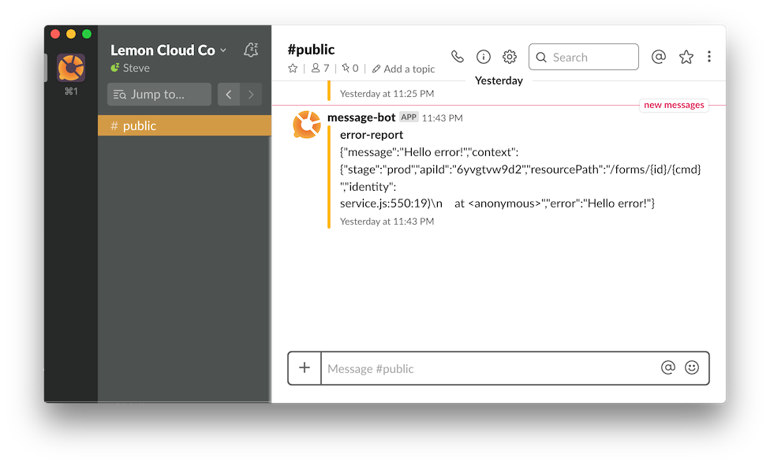

[](https://travis-ci.org/lemoncloud-io/lemon-hello-api)
[](https://codecov.io/gh/lemoncloud-io/lemon-hello-api)
[](https://badge.fury.io/js/lemon-hello-api)
[](https://badge.fury.io/gh/lemoncloud-io%2Flemon-hello-api)

# lemon-hello-api

Basic Serverless Hello API with `Lambda` + `API Gateway` + `Web Socket` + `SNS` + `SQS` + `KMS`

- Hello Nodejs DevOps Project with `babel` + `eslint` + `jest` + `supertest` + `codecov` + `travis`

- Integrate with `Slack` + `CloudWatch Alarm`


## 설명 (Description)

- `Nodejs` 기반 오픈소스 표준 개발 환경 구성안.
- AWS CloudWatch 의 내용을 `lemon-hello-sns`으로 수신 함 -> 이후 슬랙으로 전달
- 슬랙 webhook를 이용하여, 해당 슬랙 채널에 메세지를 보냄


## 사용법 (Usage)

- Nodejs 에서 모듈로 이용 (intall package with `npm`)

    ```bash
    # npm 으로 패키지 설치.
    $ npm install lemon-hello-api --save
    ```

- **Case 1** 에러 발생시 `SNS`로 정보 보내기. (Report error information via `SNS`)

    ```js
    const payload = {...};
    try {
        ...
    } catch (e){
        const hello = require('lemon-hello-api');
        // `LS=1` means 'log silence'
        const sns = hello.lemon({ LS: '1' })('sns');
        const msgId = await $sns.reportError(e, payload);
    }
    ```

- 슬랙으로 에러 정보 표시. ()

    


## 설치하기 (Installation)

**[전체 순서]**

1. `env/lemon.yml`와 `env/config.js` 파일 복제하여 별도 구성 (customize config files)
1. 환경 변수의 `SLACK_PUBLIC` 값을 변경. (change `SLACK_PUBLIC` address by slack webhook)
1. KMS 로 슬랙 채널 WebHook 암호화 시키기. (encrypt slack webhook url with `KMS`, and update `SLACK_PUBLIC`)
1. `npm run deploy` 으로 AWS 클라우드에 올리기 (deploy to AWS cloud `npm run deploy`)
1. 그리곤, 즐기자~~ (enjoy~)


### STEP.1 KMS로 설정 내용 암호화 하기

- KMS 마스터 키ID 생성하기 (최초 생성) (Create master kms-id for 1st time)

    ```bash
    # 최초의 사용자 키 생성히기.. (create initial master-key in KMS)
    $ aws kms create-key --profile <profile> --description 'hello master key'
    {
        "KeyMetadata": {
            "KeyId": "0039d20d-.....-387b887b4783",
        }
    }
    # Alias 생성하기 ('0039d20d-.....-387b887b4783'은 앞에서 생성된 KeyId 항목으로 변경) (create alias)
    $ aws kms create-alias --profile <profile> --alias-name alias/lemon-hello-api --target-key-id 0039d20d-.....-387b887b4783
    ```

- (참고) 암호화 테스트 하기. (Test encrypt)

    ```sh
    # 'hello lemon' 를 <kms-key-id>로 암호화하기...
    $ aws kms encrypt --profile <profile> --key-id alias/lemon-hello-api --plaintext "hello lemon" --query CiphertextBlob --output text
    ```

### STEP.2 AWS 클라우드에 배포 (Deploy to AWS Cloud)

- AWS Lambda 에 배포

    ```bash
    # npm 명령어 실행. (profile <lemon>)
    $ npm run deploy.lemon
    ```

## 개발 (Development)

- 로컬에서 API 서버로 실행 (runs for local development)

    ```bash
    # express API 서버 올리기 (profile <lemon>)
    $ npm run express.lemon

    # httpie 로 요청하기 
    $ http ':8888/hello/'

    # KMS 작동 여부 확인하기. (test encrypt via api)
    $ http ':8888/hello/0/test-encrypt'    
    ```

## Travis 연동

- Get NPM Token via [tokens](https://www.npmjs.com/settings/stevelemon/tokens)

```bash
# install travis-cli (MacOS)
$ brew install travis

# encrypt npm token
$ travis encrypt <NPM Token> --add deploy.api_key
```

## 기여하기 (Contribution)

누구나 어느내용이든 참여가능하며, 수정 요청시 PR 로 요청 주세요. (request via PR)


## 라이센스 (License)

[MIT](http://opensource.org/licenses/MIT)


----------------
# TODO #

- [ ] support dummy restfull api w/ dummy-storage.


----------------
# VERSION INFO #

Version History

| Version   | Description
|--         |--
| 2.1.4     | optimized with `lemon-core#2.1.4`.
| 1.3.1     | refactoring with [lemon-core](/lemoncloud-io/lemon-core).
| 1.2.3     | fix: iota of `NS` in sns-service.
| 1.1.0     | Release version with `npm run release`.
| 1.0.3     | support `SQS` with handling SQS message.
| 1.0.2     | support `WSS` with API Gateway + WebSocket.
| 1.0.1     | support `SNS` with CloudWatch Event, and post to `Slack`
| 1.0.0     | initial version with full deploy by profile+stage

